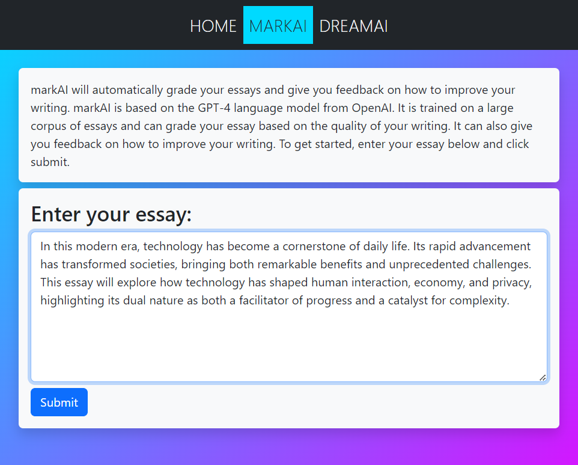
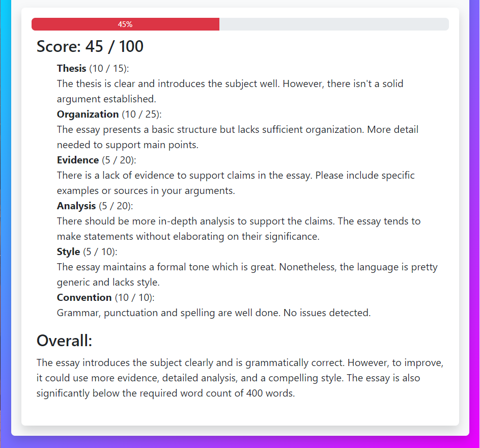

# CS39AA-Project:

NOTE: The following application is a senior project for CS39AA - Natural Language Processing at Metropolitan State University of Denver.

# Sample OpenAI Applications

My project is a Flask web app that uses OpenAI's API to tackle different tasks and showcase some sample usages for the API. Currently, the app includes:
- MarkAI Essay Grader
- DreamAI Dream Interpreter

# MarkAI Essay Grader

MarkAI automatically grades essays using OpenAI's GPT-4 language model. It evaluates the quality of writing and provides detailed feedback on various aspects of the essay.

## Features

- **Essay Evaluation**: Grades essays based on content, organization, style, and more.
- **Detailed Feedback**: Offers constructive comments on thesis, evidence, analysis, and writing conventions.
- **GPT-4 Integration**: Utilizes OpenAI's advanced GPT-4 model for accurate grading.
- **User-Friendly Interface**: Simple and clean web interface for easy essay submission.

## Examples




# DreamAI Dream Interpreter

DreamAI interprets dreams using OpenAI's GPT-4 language model. It takes in a dream and outputs a dream interpretation based on 3 major schools of thought: Freudian, Jungian, and Cognitive.

## Features

- **Dream Interpretation**: Interprets dreams based on Freudian, Jungian, and Cognitive schools of thought.
- **GPT-4 Integration**: Utilizes OpenAI's advanced GPT-4 model for accurate dream interpretation.
- **User-Friendly Interface**: Simple and clean web interface for easy dream submission.

## Getting Started

### Prerequisites

- Python 3.6+
- Flask
- An API key for OpenAI's GPT-4

### Installation

Clone the repository to your local machine:

```sh
git clone https://github.com/yourusername/markai-essay-grader.git
cd markai-essay-grader
```

Install the required Python packages:

```sh
pip install -r requirements.txt
```

### Setup

Before running the application, set up your OpenAI API key as an environment variable:

```sh
export OPENAI_API_KEY='your-api-key'
```

### Running the Application

Start the Flask server with:

```sh
flask run
```

Navigate to `http://127.0.0.1:5000/` in your web browser to use the application.

## Usage

1. Enter your essay into the provided text area.
2. Click the 'Submit' button to send your essay for grading.
3. Wait for the grading process to complete; a "Grading..." indicator will show progress.
4. Review your score and detailed feedback once the grading is complete.

## Contributing

Contributions to MarkAI are welcome! Please follow these steps to contribute:

1. Fork the repository.
2. Create a new branch for your feature (```git checkout -b feature/AmazingFeature```).
3. Commit your changes (```git commit -m 'Add some AmazingFeature```).
4. Push to the branch (```git push origin feature/AmazingFeature```).
5. Open a pull request.

## License

Distributed under the MIT License. See `LICENSE` for more information.

## Contact

Freeman

Project Link: [https://github.com/FreemanDigital/CS39AA-Project](https://github.com/FreemanDigital/CS39AA-Project)

## Acknowledgments

- OpenAI Team for providing the GPT-4 API.
- Bootstrap for the front-end framework.
- All contributors who help in improving MarkAI.
